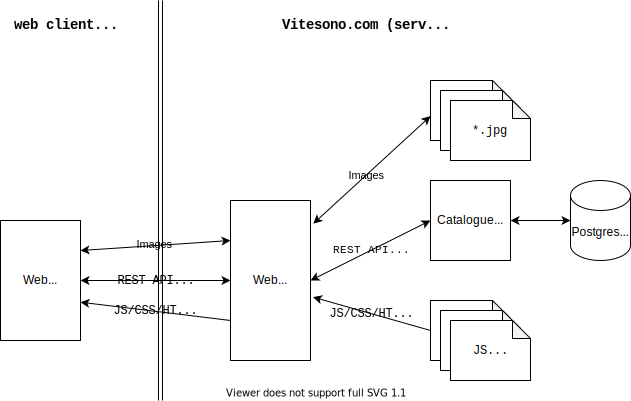

# Vitesono

## Description

- Création d'un backoffice permettant de consulter et de modifier un catalogue en ligne d'équipements de sonorisation
- Chaque produit référencé est catégorisé, par exemple

```
-> Sonorisation
  -> Enceintes de Sonorisation
    -> Enceintes Actives Large Bande
      -> Mackie Thump 15A
```
!
- Chaque produit est associé à un ensemble de données exploitées lors de l'affichage de la vue détaillée du produit

```
Nom
Description technique
Images
```

## Architecture logicielle


